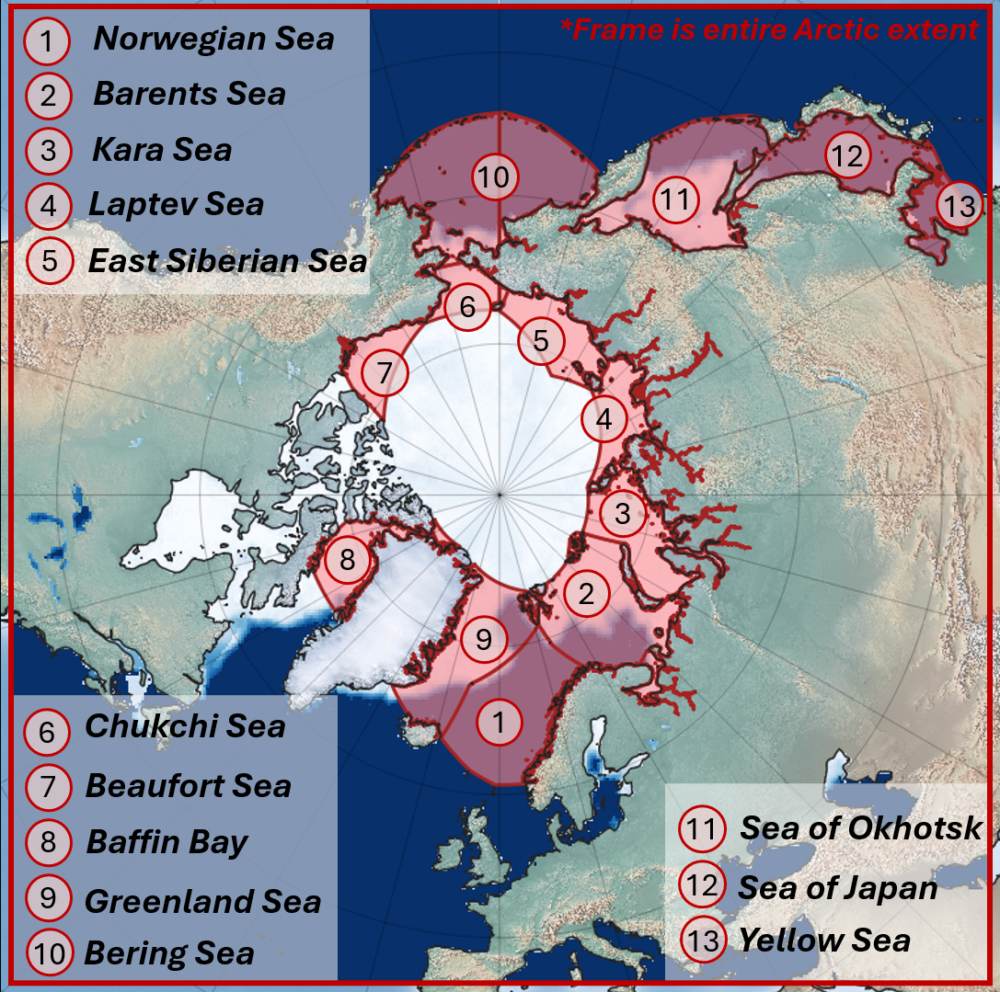

The leaderboard compares model performance on the AIICE evaluation dataset across multiple metrics and sea regions.
You can explore model configurations in [examples](https://github.com/ITMO-NSS-team/Aiice/tree/main/scripts/experiments).

{ width=600, style="display:block;margin:0 auto;" }

The full benchmark covers the entire Arctic Ocean basin shown below. For the leaderboard we selected 5 seas that we find most dynamically interesting — regions with pronounced seasonal variability and complex ice dynamics:
**Barents Sea**, **Kara Sea**, **Laptev Sea**, **Chukchi Sea**, and **Sea of Japan**.

## How to read the results

- **Overview** — averaged scores across all forecast lengths and steps; shows the best-performing model per metric in each sea region.
- **Radar chart** — normalized per metric; closer to the edge means better. Hover over a point to see the raw value.
- **Tables** — models ranked best → worst for the selected configuration. Bar lengths are min–max normalized: the best model always gets a full bar.

All metric definitions and formulas are on the [Metrics reference](api/metrics.md) page.

!!! note
    To add your model to the leaderboard, follow the [leaderboard instruction](https://github.com/ITMO-NSS-team/Aiice/tree/main/scripts/experiments/README.md) and the [Contributing guide](contributing.md).

